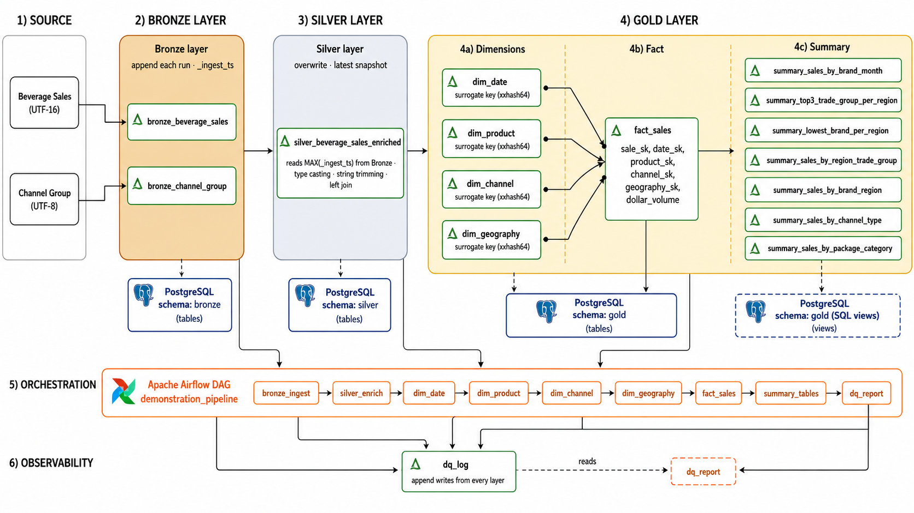

# Beverage Sales Analytics — Data Engineering Demo

**Stack:** Docker Compose · PySpark 3.4 · Delta Lake 2.4 · Apache Airflow 2.9 · PostgreSQL 15 · JupyterLab

---

## Quick Start

```bash
docker compose build
docker compose up airflow-init     # run once
docker compose up -d
```


| Service    | URL                                            | Credentials         |
| ---------- | ---------------------------------------------- | ------------------- |
| JupyterLab | [http://localhost:8888](http://localhost:8888) | no password         |
| Airflow    | [http://localhost:8080](http://localhost:8080) | admin / admin       |
| PostgreSQL | localhost:5432                                 | beverage / beverage |


Trigger the pipeline: Airflow → DAG `demonstration_pipeline` → ▶ Trigger.

---


## Architecture


### Medallion layers

The pipeline follows a three-layer medallion architecture. Each layer has a clear contract and its own PostgreSQL schema.


| Layer       | Delta path                     | PG schema      | Write mode                 | Role                                                                                                         |
| ----------- | ------------------------------ | -------------- | -------------------------- | ------------------------------------------------------------------------------------------------------------ |
| **Bronze**  | `delta_storage/bronze/`        | `bronze`       | **append**                 | Raw source data, unchanged. Every run adds a new timestamped batch. Immutable record of all ingestions.      |
| **Silver**  | `delta_storage/silver/`        | `silver`       | **overwrite**              | Cleaned, typed, enriched snapshot. Always rebuilt from the latest Bronze batch (`MAX(_ingest_ts)`).          |
| **Gold**    | `delta_storage/gold/`          | `gold`         | **overwrite**              | Star schema: 4 dimensions + 1 fact table. Read from Silver.                                                  |
| **Summary** | `delta_storage/gold/summary_`* | `gold` (views) | Delta overwrite / PG views | Business aggregations. Stored physically in Delta; exposed as SQL views in PostgreSQL (no data duplication). |


### Star schema (Gold)

```
dim_date ──┐
dim_product──┤
             ├──▶ fact_sales ──▶ summary views (PostgreSQL)
dim_channel──┤                    (Delta tables for Spark)
dim_geography┘
```

Surrogate keys are generated with `xxhash64`. The fact table holds `dollar_volume` and foreign keys only — no descriptive columns.

### Orchestration

Airflow DAG `demonstration_pipeline` runs all notebooks sequentially via `papermill` CLI:

```
bronze_ingest → silver_enrich
             → dim_date → dim_product → dim_channel → dim_geography
             → fact_sales → summary_tables → dq_report
```

Dimensions run sequentially (not in parallel) to stay within the single-JVM memory budget of the local Docker environment.

### Observability

Every notebook writes DQ check results to `delta_storage/gold/dq_log` (Delta append). The final `dq_report` notebook deduplicates by `(layer, table, check)` and surfaces the latest result for each check. Any FAIL raises an exception and marks the Airflow task as failed.

---


## Design Decisions

- **Bronze is append-only.** Each pipeline run adds a new batch (identified by `_ingest_ts`). Silver always reads `MAX(_ingest_ts)` to get the latest snapshot, making reruns safe without data loss.
- **Spark can't read this CSV natively.** The sales file is UTF-16 LE with BOM. Spark's built-in UTF-16LE reader silently produces null data rows — only the header is parsed. Fix: read via `pandas.read_csv(..., encoding="utf-16")`, then promote to Spark DataFrame.
- **Delta rejects** `$ Volume` **as a column name.** Dollar sign and space are illegal in Delta column names. The column is renamed to `dollar_volume_raw` immediately on ingest.
- **Silver uses** `select([...].alias(...))` **not** `withColumn` **+** `drop`**.** Spark column resolution is case-insensitive: `withColumn("trade_chnl_desc", ...)` silently replaces `TRADE_CHNL_DESC`, so the subsequent `.drop("TRADE_CHNL_DESC")` removes the newly created column. A single `select` with explicit aliases avoids this entirely.
- **Summary tables are views in PostgreSQL, not tables.** The data lives in `gold.fact_sales`. Views are defined as SQL joins against the Gold tables — no ETL duplication, always consistent with the latest pipeline run.
- **Dimensions are serialised sequentially in the DAG.** Four parallel Spark JVMs × 1 GB each exhausted Docker's memory in testing. Sequential execution is slower but stable in a local environment; in Databricks they would run in parallel on separate clusters.

---


## Business Questions Answered


| Requirement                         | PostgreSQL query                                                                 |
| ----------------------------------- | -------------------------------------------------------------------------------- |
| Top 3 trade groups per region       | `SELECT * FROM gold.summary_top3_trade_group_per_region ORDER BY region, rank`   |
| $ volume per brand per month        | `SELECT * FROM gold.summary_sales_by_brand_month ORDER BY year, month, brand_nm` |
| Brand with lowest volume per region | `SELECT * FROM gold.summary_lowest_brand_per_region ORDER BY region`             |


---


## Architecture Diagram



---

